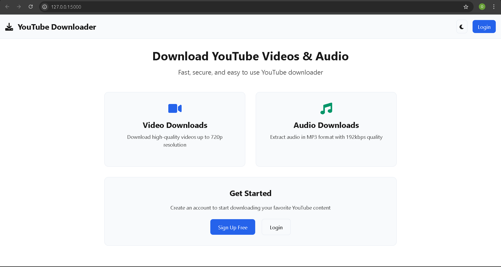
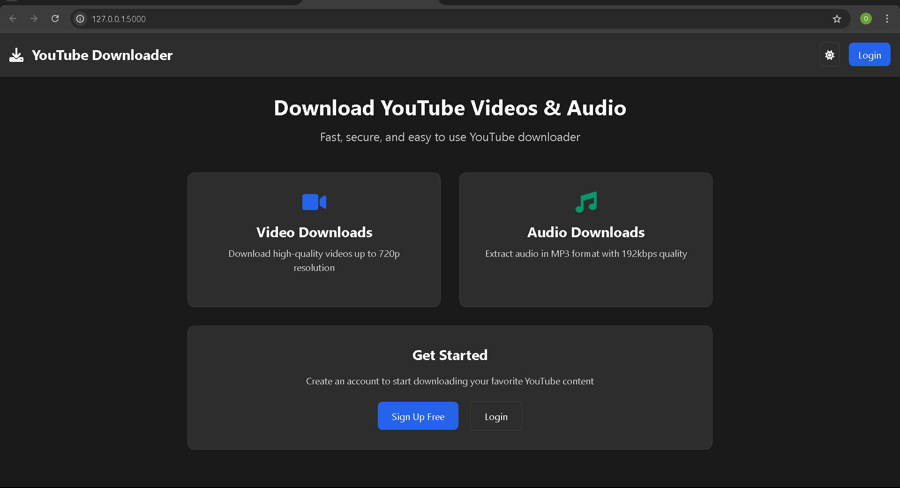
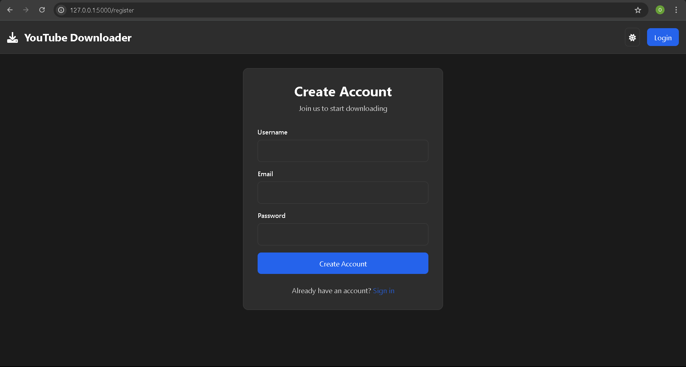
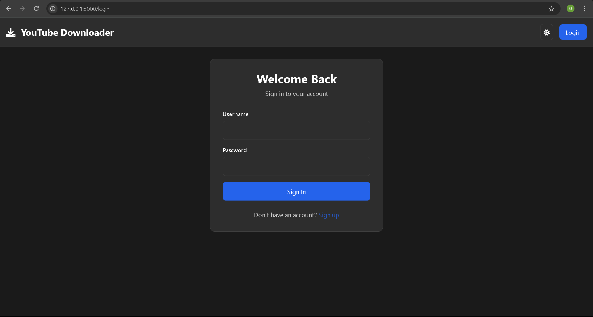
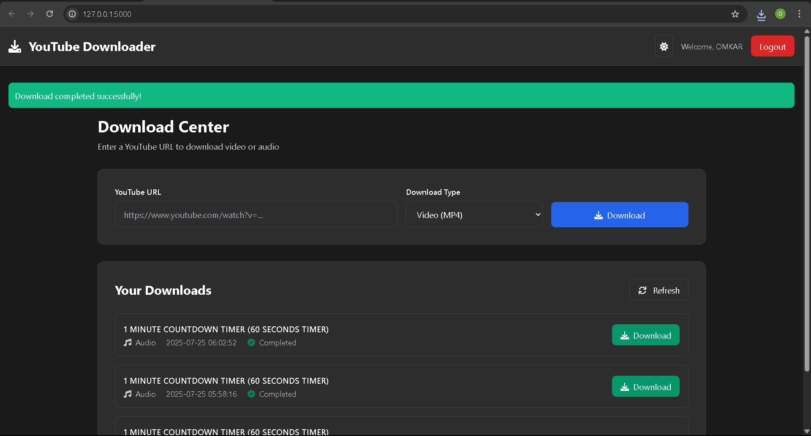
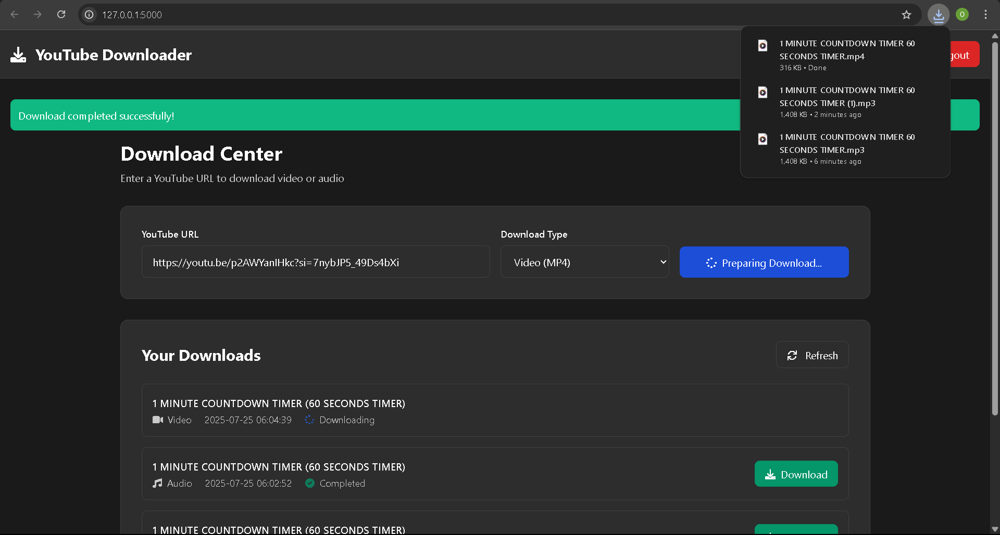

# YouTube-Video-Audio-Downloader

## Preview/Screenshots
Here are some visual previews of the application's interface:

### Landing Page


*The initial landing page of the application.*

### User Authentication


*A secure interface for user registration and login.*

### Dashboard View

*The primary area where users input YouTube URLs for downloads.*

### Download History

*A section showcasing all your successfully completed downloads.*


## About
A user-friendly web application built with Flask that enables authenticated users to download YouTube videos as either MP4 (video up to 720p) or MP3 (audio) files. It features a secure user authentication system and a personal dashboard to keep track of download history, focusing on completed downloads while automatically clearing failed attempts.

## Features
* **User Authentication:** Secure registration, login, and logout functionalities powered by Flask-Login and Bcrypt.
* **Flexible Downloads:** Download YouTube content as:
    * **MP4 Video:** Best available video quality up to 720p, merged with best audio.
    * **MP3 Audio:** High-quality 192kbps MP3 extraction.
* **Personal Dashboard:** View a history of your successfully completed downloads.
* **Automated Cleanup:** Failed download attempts are automatically removed from your history and temporary files are cleaned up from the server.
* **Robust Error Handling:** Provides user feedback for download failures.

## Technologies Used
* **Backend:** Python 3.x
* **Web Framework:** Flask
* **Database:** SQLite3 (managed by Flask-SQLAlchemy)
* **Authentication:** Flask-Bcrypt, Flask-Login
* **Video/Audio Processing:** `yt-dlp` (for fetching and downloading content), `ffmpeg` (for format conversion and merging, required by `yt-dlp`).
* **Web Server (Production):** Gunicorn
* **Client-side:** HTML, CSS, JavaScript (for dynamic updates)

## Getting Started

Follow these instructions to get a copy of the project up and running on your local machine for development and testing purposes.

### Prerequisites
Before you begin, ensure you have the following installed:
* **Python 3.8+:** Download from [python.org](https://www.python.org/downloads/).
* **`pip`:** Python package installer (usually comes with Python).
* **`ffmpeg`:** Essential for `yt-dlp` to process and convert media. Download it from [ffmpeg.org](https://ffmpeg.org/download.html) and ensure it's added to your system's PATH.

### Local Installation

1.  **Clone the repository:**
    ```bash
    git clone https://github.com/OmkarYelsange/YouTube-Video-Audio-Downloader 
    cd "YouTube-Video-Audio-Downloader" 
    ```

2.  **Create and activate a Python virtual environment:**
    ```bash
    python -m venv .venv
    # On Windows:
    .\.venv\Scripts\activate
    # On macOS/Linux:
    source ./.venv/bin/activate
    ```

3.  **Install project dependencies:**
    ```bash
    pip install -r requirements.txt
    ```

### Database Initialization

This step creates the necessary SQLite database file and tables required by the application.

1.  Ensure your virtual environment is active.
2.  Set the Flask application environment variable:
    * **On Windows (PowerShell):**
        ```powershell
        $env:FLASK_APP="A.py"
        ```
    * **On macOS/Linux/Git Bash:**
        ```bash
        export FLASK_APP=A.py
        ```
3.  Run the database creation commands:
    ```bash
    flask shell
    ```
    At the Python prompt (`>>>`), type the following lines and press Enter after each:
    ```python
    from A import db, app
    with app.app_context():
        db.create_all()
    exit()
    ```

### Running Locally

After setting up the database, you can start the Flask development server:

1.  Ensure your virtual environment is active.
2.  Run the application:
    ```bash
    python A.py
    ```
    You should see output indicating the server is running, typically on `http://127.0.0.1:5000/`. Open this URL in your web browser.

## Usage
1.  Navigate to your local server address (e.g., `http://127.0.0.1:5000/`).
2.  Register a new user account or log in with existing credentials.
3.  Once logged in, you'll be on your dashboard.
4.  Paste the YouTube video URL into the provided input field.
5.  Select your desired download type: 'Audio' (MP3) or 'Video' (MP4).
6.  Click the 'Download' button. The server will process the request, and the file will be sent to your browser as an attachment.
7.  Successfully completed downloads will appear in your download history on the dashboard. Failed attempts will not be shown.


### Contact

👤 **Omkar Yelsange**  
💼 **GitHub:** [OmkarYelsange](https://github.com/OmkarYelsange)    
📧 **Email:** omkaryelsange1010@gmail.com  
🔗 **Project Repository:** [View on GitHub](https://github.com/OmkarYelsange/YouTube-Video-Audio-Downloader)  
💬 **LinkedIn:** [Omkar Yelsange](https://www.linkedin.com/in/omkaryelsange)